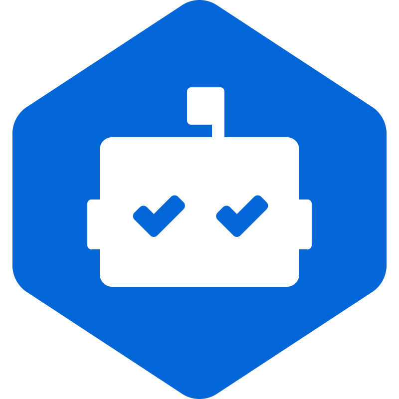

<!--  -->

<h1> 
   
  Hi, I'm Alexander Gorbunov
</h1>

Love to create frontend applications, draw prototypes in Figma, study UI/UX.

<h2>👤 About me</h2>

<table>
  <tr>
    <th align="left">My projects (25+)</th>
    <td>
      
      <a href="https://github.com/arlagonix/arlagonix.github.io">
        <strong>Github</strong>
      </a>
    </td>
  </tr>

  <tr><!-- Empty row that helps to make all rows in the table have the same bg color --></tr>
  <tr>
    <th align="left">How to reach me</th>
    <td>
      
      <a href="https://www.linkedin.com/in/alex-gorbunov/">
        <strong>LinkedIn</strong>
      </a>
    </td>
  </tr>
  
  <tr><!-- Empty row that helps to make all rows in the table have the same bg color --></tr>
  <tr>
    <th align="left">Languages</th>
    <td>
      
        
        <strong>Russian</strong>
      
      <strong>⸱</strong>
      
        
        <strong>English</strong>
      
    </td>
  </tr>
  
  <tr><!-- Empty row that helps to make all rows in the table have the same bg color --></tr>
  <tr>
    <th align="left">Miscellaneous</th>
    <td>
      
      <a href="https://www.frontendmentor.io/profile/arlagonix">
        <strong>FrontendMentor Profile</strong>
      </a>
      <strong>⸱</strong>
      
      <a href="https://www.freecodecamp.org/Arlagonix">
        <strong>freeCodeCamp Profile</strong>
      </a>
      <strong>⸱</strong>
      
      <a href="https://leetcode.com/arlagonix/">
        <strong>LeetCode Profile</strong>
      </a>
      <strong>⸱</strong>
      
      <a href="https://t.me/ba_sa_materials">
        <strong>BA/SA Materials</strong>
      </a> (my tg channel)
    </td>
  </tr>
</table>

<h2>🔨 Tools and languages</h2>

<table>
  <tr>
    <!-- Empty row that helps to make all rows in the table have the same bg color -->
  </tr>
  <tr>
    <th></th>
    <th>🥇 More experience</th>
    <th>🥈 Some experience</th>
    <th>🥉 Less experience</th>
  </tr>

  <tr>
    <th align="left">Fundamentals</th>
    <td>
      
      <a href="https://www.w3schools.com/html/default.asp">
        <strong>HTML</strong>
      </a>
       
      
      <a href="https://www.w3schools.com/css/css_intro.asp">
        <strong>CSS</strong>
      </a>
       
      
      <a href="https://developer.mozilla.org/en-US/docs/Learn/JavaScript/First_steps/What_is_JavaScript">
        <strong>JavaScript</strong>
      </a>
       
      
      <a href="https://www.typescriptlang.org/">
        <strong>TypeScript</strong>
      </a>
    </td>
    <td></td>
    <td>
      
      <a href="https://www.python.org/">
        <strong>Python</strong>
      </a>
       
      
      <a href="https://cplusplus.com/">
        <strong>C++</strong>
      </a>
       
      
      <a href="https://en.wikipedia.org/wiki/C_(programming_language)">
        <strong>C</strong>
      </a>
    </td>
  </tr>

  <tr>
    <!-- Empty row that helps to make all rows in the table have the same bg color -->
  </tr>
  <tr>
    <th align="left">Frontend frameworks,  libraries</th>
    <td>
      
      <a href="https://reactjs.org/">
        <strong>ReactJS</strong>
      </a>
    </td>
    <td>
      
      <a href="https://nextjs.org/learn/foundations/about-nextjs/what-is-nextjs">
        <strong>NextJS</strong>
      </a>
    </td>
    <td>
    </td>
  </tr>

  <tr>
    <!-- Empty row that helps to make all rows in the table have the same bg color -->
  </tr>
  <tr>
    <th align="left">Styling, Component libraries</th>
    <td>
      
      <a href="https://styled-components.com/">
        <strong>styled-components</strong>
      </a>
       
      
      <a href="https://sass-lang.com/">
        <strong>SASS/SCSS</strong>
      </a>
       
      
      <a href="https://en.bem.info/">
        <strong>BEM</strong>
      </a>
    </td>
    <td>
      
      <a href="https://tailwindcss.com/">
        <strong>TailwindCSS</strong>
      </a>  
       
      
      <a href="https://postcss.org/">
        <strong>CSS Modules</strong>
      </a>
    </td>
    <td>
      
      <a href="https://postcss.org/">
        <strong>PostCSS</strong>
      </a>  
       
      
      <a href="https://mui.com/">
        <strong>Material UI</strong>
      </a> 
       
      
      <a href="https://ant.design/">
        <strong>Ant Design</strong>
      </a> 
    </td>
  </tr>

  <tr>
    <!-- Empty row that helps to make all rows in the table have the same bg color -->
  </tr>
  <tr>
    <th align="left">Bundlers</th>
    <td>
      
      <a href="https://vitejs.dev/">
        <strong>Vite</strong>
      </a>
    </td>
    <td>
      
      <a href="https://nextjs.org/docs/api-reference/create-next-app">
        <strong>Create Next App</strong>
      </a> 
       
      
      <a href="https://create-react-app.dev/">
        <strong>Create React App</strong>
      </a>
       
      
      <a href="https://webpack.js.org/">
        <strong>Webpack</strong>
      </a>
    </td>
    <td>
    </td>
  </tr>

  <tr>
    <!-- Empty row that helps to make all rows in the table have the same bg color -->
  </tr>
  <tr>
    <th align="left">Testing</th>
    <td></td>
    <td>
      
      <a href="https://www.cypress.io/">
        <strong>Cypress</strong>
      </a>
       
      
      <a href="https://vitest.dev/">
        <strong>Vitest</strong>
      </a>
    </td>
    <td></td>
  </tr>

  <tr>
    <!-- Empty row that helps to make all rows in the table have the same bg color -->
  </tr>
  <tr>
    <th align="left">API requests,  state management</th>
    <td></td>
    <td>
      
      <a href="https://react-query-v3.tanstack.com/">
        <strong>React Query</strong>
      </a>
    </td>
    <td>
      
      <a href="https://redux-toolkit.js.org/">
        <strong>Redux Toolkit</strong>
      </a>
    </td>
  </tr>

  <tr>
    <!-- Empty row that helps to make all rows in the table have the same bg color -->
  </tr>
  <tr>
    <th align="left">Hosting, Infrastructure</th>
    <td>
      
      <a href="https://pages.github.com/">
        <strong>Github Pages</strong>
      </a>
    </td>
    <td>
      
      <a href="https://github.com/features/actions">
        <strong>Github Actions</strong>
      </a>
    </td>
    <td>
      
      <a href="https://vercel.com/">
        <strong>Vercel</strong>
      </a>
       
      
      <a href="https://www.netlify.com/">
        <strong>Netlify</strong>
      </a>
    </td>
  </tr>

  <tr>
    <!-- Empty row that helps to make all rows in the table have the same bg color -->
  </tr>
  <tr>
    <th align="left">Animation</th>
    <td></td>
    <td></td>
    <td>
      
      <a href="https://www.framer.com/motion/introduction/">
        <strong>Framer Motion</strong>
      </a>
       
      
      <a href="https://animejs.com/">
        <strong>AnimeJS</strong>
      </a>
    </td>
  </tr>
  
  <tr>
    <!-- Empty row that helps to make all rows in the table have the same bg color -->
  </tr>
  <tr>
    <th align="left">Code repositories</th>
    <td>
      
      <a href="https://github.com/">
        <strong>Github</strong>
      </a>
    </td>
    <td>
      
      <a href="https://about.gitlab.com/">
        <strong>Gitlab</strong>
      </a>
    </td>
    <td></td>
  </tr>
  
  <tr>
    <!-- Empty row that helps to make all rows in the table have the same bg color -->
  </tr>
  <tr>
    <th align="left">Instruments</th>
    <td>
      
      <a href="https://code.visualstudio.com/">
        <strong>VS Code</strong>
      </a>
       
      
      <a href="https://git-scm.com/">
        <strong>Git</strong>
      </a>
       
      
      <a href="https://figma.com/">
        <strong>Figma</strong>
      </a>
    </td>
    <td></td>
    <td></td>
  </tr>

  <tr>
    <!-- Empty row that helps to make all rows in the table have the same bg color -->
  </tr>
  <tr>
    <th align="left">Miscellaneous</th>
    <td>
      
      <a href="https://prettier.io/">
        <strong>Prettier</strong>
      </a>
       
      
      <a href="https://www.atlassian.com/software/confluence">
        <strong>Confluence</strong>
      </a>
       
      
      <a href="https://www.atlassian.com/software/jira">
        <strong>Jira</strong>
      </a>
       
      
      <a href="https://www.npmjs.com/">
        <strong>NPM</strong>
      </a>
    </td>
    <td>
      
      <a href="https://reactrouter.com/en/main">
        <strong>React Router</strong>
      </a>
       
      
      <a href="https://eslint.org/">
        <strong>Eslint</strong>
      </a>
       
      
      <a href="https://github.com/dependabot">
        <strong>Dependabot</strong>
      </a>
    </td>
    <td>
      
      <a href="https://storybook.js.org/">
        <strong>Storybook</strong>
      </a>
       
      
      <a href="https://www.i18next.com/">
        <strong>i18next</strong>
      </a>
    </td>
  </tr>
</table>

